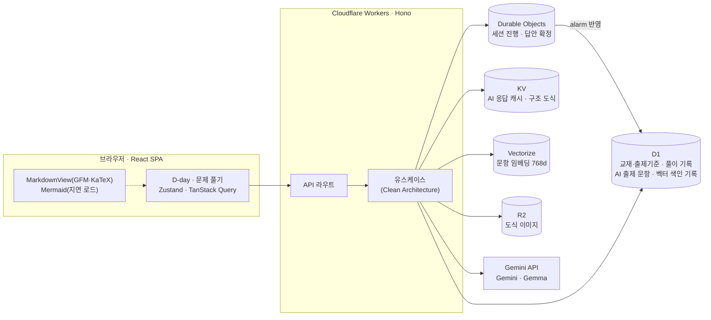

# 투자용사 (kagemori)

투자자산운용사 시험 D-day와 적응형 문제 풀이를 제공하는 개인용 학습 앱입니다.

- 서비스: https://kagemori.qus0in.workers.dev
- 저장소: https://github.com/qus0in/kagemori
- 설계 결정: [docs/adr](docs/adr) · 작업 스킬: [.agents/skills](.agents/skills)

## 시스템 아키텍처

| 영역 | 역할 |
|---|---|
| Durable Objects | 세션별 단일 진실 공급원. revision 비교 트랜잭션으로 동시 제출을 막고, 확정 답안을 alarm으로 D1에 멱등 반영 |
| D1 | 교재 목차·출제기준, 전체 풀이 이력(문항별 최신 결과 = 진도), AI 출제·검수 통과 문항, 임베딩 색인 기록 |
| KV | 힌트·해설 응답 캐시(프롬프트 해시 키), 구조 도식과 이미지 위치, 세션 메타데이터 |
| Vectorize | 문항 의미 중복 차단, 최근 오답과 유사한 문항 우선 출제 |
| R2 | 생성된 도식 이미지 원본. 답안 제출이 확인된 세션 경로로만 제공 |

- **계층 구조**: `domain`(모델·포트) ← `app`(유스케이스) ← `infra`(D1·DO·KV·Vectorize·R2·Gemini 어댑터) / `ui`(React). 의존성은 안쪽으로만 향합니다.
- **출제 흐름**: 세션 생성 시 풀이 이력으로 `미풀이 → 오답·힌트 → 정답(오래된 순)` 목록을 즉시 확정해 DO에 저장합니다. 미풀이 문항이 모자라면 1·2번을 기존 문항으로 푸는 동안 3번 이후를 AI가 백그라운드로 출제·검수해 교체하고, 늦으면 대기 안내 또는 기존 문항으로 대체합니다.
- **장애 격리**: 보조 모델·캐시·색인 실패는 해당 단계만 건너뛰고, 채점·진도 저장소(DO·D1) 장애는 503으로 드러냅니다.

## 모델 활용

| 모델 | 용도 | 시점 |
|---|---|---|
| `gemini-3.8-flash` | 품질 미달·검토 실패 보정, 사용자 해설 재요청, 부족 문항 출제·1차 블라인드 검수 | 제출 후 · 세션 생성 · 도식 요청 |
| `gemini-3.5-flash-lite` | 주력: 개념 힌트·일반 제출 해설·Mermaid/표 초안, 도식 표현 방식 판정 | 힌트 요청 · 제출 후 · 도식 요청 |
| `gemma-4-31b-it` | 다른 계열 모델의 교차 블라인드 검수(두 검수자 답 일치 시에만 저장) | 세션 생성(출제 시) |
| `gemma-4-26b-a4b-it` | Lite 응답 품질 검토, 출제 초안 선별·쟁점 태깅, 도식 판정 대체 | 실시간 응답 · 세션 생성 · 도식 요청 |
| `gemini-embedding-2` | 768차원 임베딩으로 의미 중복 차단(0.9 이상), 약점 유사 문항 우선(0.82 이상) | 세션 생성 |
| `gemini-3.1-flash-image` | 구조 도식으로 부족할 때만 개념 도식 이미지 생성(문항 버전별 1회) | 도식 요청 |

- 모든 AI 기능은 답안 제출 전 정답을 노출하지 않습니다. 시험 통과 점검에는 AI 출제 문항을 섞지 않습니다.
- Lite 초안은 Gemma 승인 후 제공하며 검토 미달·실패는 3.8로 승격합니다. 검토 완료/승격 성공 응답만 캐시합니다.
- 해설·힌트는 서두와 질문 복창 없이 수험 핵심 근거만 제공하도록 프롬프트를 고정했습니다.

## 스킬셋

**Frontend**

**Backend · Infra**

**AI**

**Quality**

